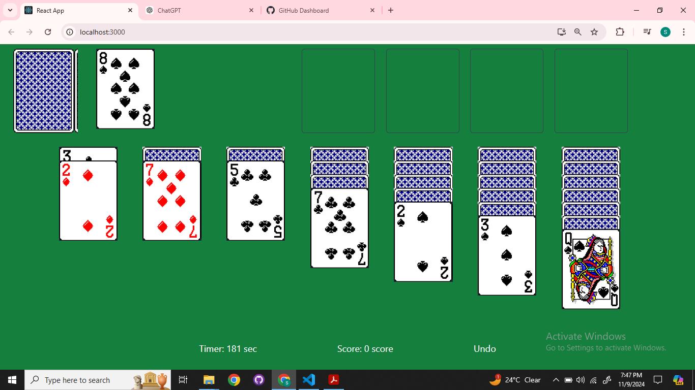

# Solitaire Game

## Description
This project is a digital adaptation of the classic solitaire card game built using modern web technologies on klondikle game rules. It features an interactive user interface, leveraging tailwind CSS for styling, JavaScript for interactivity, React JS for component-based UI development.This project is built using basic Data structures for its implementation. 

## Features

- **Data Structure**: LinkedList,stack,queue,array implementation.
- **Scoreboard**: Tracks and displays the player's score and time.
- **Validation and Testing**: Valid moves, Card flipping and wincondition testing

## Preview Link

## Screenshots

### Game Mode

## How to run the game

In the project directory, you can run:

### `npm start`

Runs the app in the development mode.\
Open [http://localhost:3000](http://localhost:3000) to view it in your browser.

The page will reload when you make changes.\
You may also see any lint errors in the console.

### `npm test`

Launches the test runner in the interactive watch mode.\
See the section about [running tests](https://facebook.github.io/create-react-app/docs/running-tests) for more information.

### `npm run build`

Builds the app for production to the `build` folder.\
It correctly bundles React in production mode and optimizes the build for the best performance.

The build is minified and the filenames include the hashes.\
Your app is ready to be deployed!

See the section about [deployment](https://facebook.github.io/create-react-app/docs/deployment) for more information.

### `npm run eject`
### Dependencies
Following dependencies are required to run the game:
- Node JS
